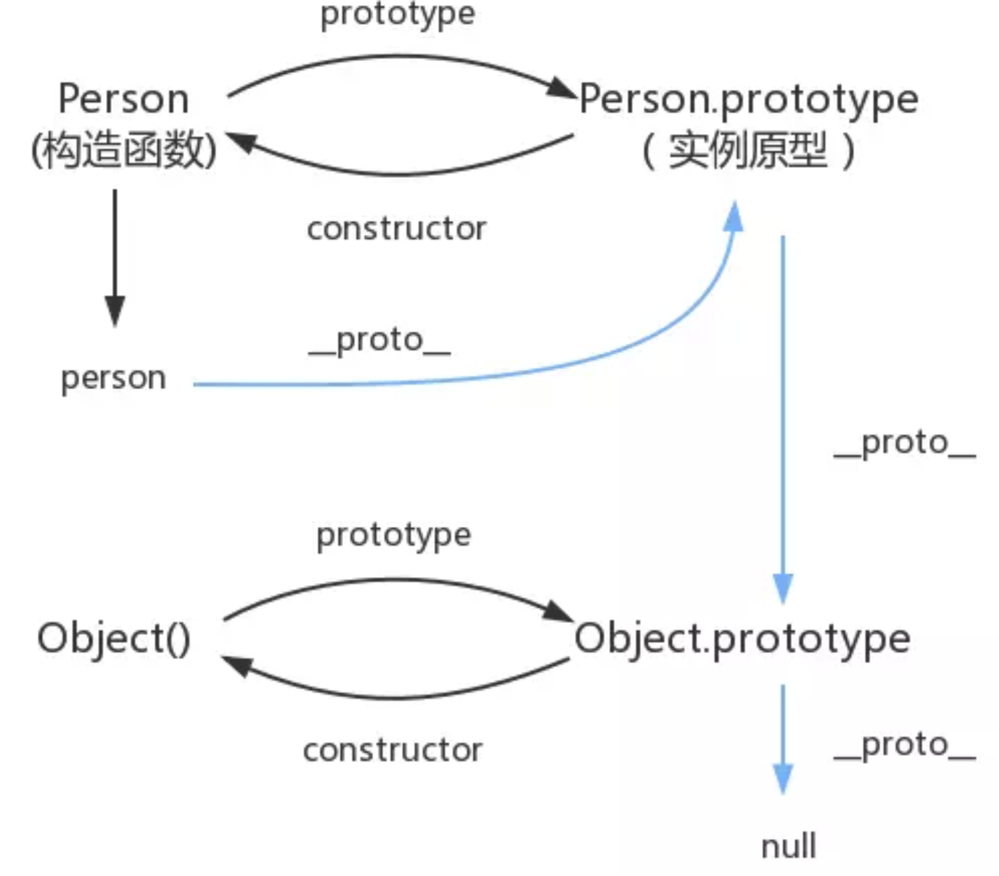

# 类

## ES5 中怎么声明一个类

```js
let Animal = function(type) {
  this.type = type
  this.eat = function() {
    console.log("abc")
  }
}

let dog = new Animal("dog")
let monkey = new Animal("monkey")
monkey.eat = function() {
  console.log("error")
}
dog.eat() // abc
monkey.eat() // error
// 问题：每个对象都有相应的方法属性，如果修改对象的方法属性，类的那个方法属性将会不能控制所有继承的对象的那个属性
```

```js
// 解决方法：将函数挂在原型链上
let Animal = function(type) {
  this.type = type
}
Animal.prototype.eat = function() {
  console.log("abc")
}
let dog = new Animal("dog")
let monkey = new Animal("monkey")
dog.eat()                   // abc
monkey.eat()                // abc
// monkey.constructor.prototype.eat = function(){
//     console.log('def')
// }
// dog.eat()                   // def
// monkey.eat()                // def
```

- 

## ES6 中怎么声明一个类

```js
// 等同于ES5原型链生成的语法糖
class Animal {
  constructor(type) {
    this.type = type
  }
  eat() {
    console.log("abc")
  }
}

let dog = new Animal("dog")
let monkey = new Animal("monkey")
dog.eat()                       // abc
monkey.eat()                    // abc

console.log(typeof Animal)      // function
```

## 属性

- 对象属性只读
- 函数前带get或set就变成了属性
- getter和setter可以控制属性的读写，age为暴露出去的接口，实际的数据不存储在age上

```js
let _age = 4
class Animal {
  constructor(type) {
    this.type = type
  }
  // 使用闭包进行私有数据的保护
  // 本身是函数，所以可以写一些业务逻辑，但调用是属性
  get age() {
      return _age
  }
  set age(val) {
      if (val < 7 && val > 4) {
          _age = val
      }
  }
  eat() {
    console.log("abc")
  }
}
let dog = new Animal('dog')
console.log(dog.age)                // 4
dog.age = 8
console.log(dog.age)                // 8
```

## 方法

- 静态方法
  - 只能从类访问这个方法，不能通过对象实例访问

- ES5

    ```js
    let Animal = function(type) {
        this.type = type
    }

    Animal.prototype.eat = function() {
        Animal.walk()
        console.log("abc")
    }

    Animal.walk = function() {
        console.log('def')
    }
    let dog = new Animal('dog')
    dog.eat()                           // abc def
    ```

- ES6

    ```js
    class Animal {
        constructor(type) {
            this.type = type
        }
        eat() {
            Animal.walk()
            console.log("abc")
        }
        static walk() {
            console.log('def')
        }
    }
    let dog = new Animal('dog')
        dog.eat()                           // abc def
    ```

- 方法内部要使用实例对象的信息时，设置为实例对象方法
- 静态方法拿不到实例对象信息

    ```js
    class Box{
        constructor(num1, num2) {
            this.num1 = num1;
            this.num2 = num2;
        }
        // 可以直接拿对象信息
        sum() {
            return this.num1 + this.num2;
        }
    }
    ```

## 继承

- ES5

    ```js
    let Animal = function(type) {
        this.type = type
    }

    Animal.prototype.eat = function() {
        Animal.walk()
        console.log("abc")
    }

    Animal.walk = function() {
        console.log('def')
    }

    let Dog = function() {
        // 初始化父类的构造函数
        // 只继承了Animal构造函数
        Animal.call(this, 'dog'/*父类的参数*/)        // call改变this的指向，指向Dog的实例
        this.run = function() {
            console.log('run run')
        }
    }

    // 将Dog的prototype指向Animal的prototype，原型链继承
    Dog.prototype = Animal.prototype

    let dog = new Dog('dog')
    dog.eat()                           // abc def
    ```

- ES6

```js
class Animal {
    constructor(type) {
        this.type = type
    }
    eat() {
        Animal.walk()
        console.log("abc")
    }
    static walk() {
        console.log('def')
    }
}

class Dog extends Animal {
    // constructor (type) {             // 如果没有自己的构造函数，只有父类的，可以省略
    //     super(type)
    // }
    constructor () {
        super('dog')
        this.age = 2
    }
}

let dog = new Animal('dog')
    dog.eat()                           // abc def
```
