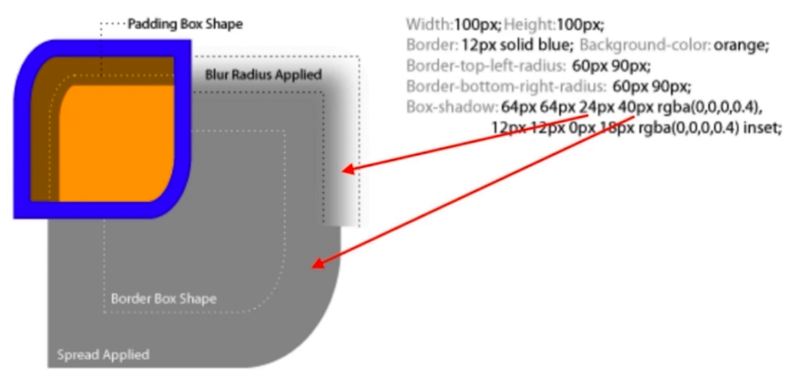

# CSS效果

## box-shadow

- 
- inset 内阴影
- 可以完成很复杂的绘画
- 营造层次感（立体感）
- 充当没有宽度的边框
- 特殊效果

## text-shadow

- 立体感
- 印刷品质感

## border-radius

- 圆角矩形
- 圆形
- 半圆 / 扇形
- 一些奇奇怪怪的角
- 垂直方向 / 水平方向分别设定radius像素 实现椭圆和一些奇奇怪怪的角

## background

- 纹理 / 图案
- 渐变
- 雪碧图动画
- 背景图尺寸适应

  ```css
  .container {
      /* 长宽比不变 充满或者完整显示 */
      background-size: cover;
      background-size: contain;
  }
  ```

## clip-path

- 对容器进行裁剪
  - 容器占位不变
  - 便于做容器内动画

  ```css
  .container {
      /* clip-path: inset(100px 50px); */
      clip-path: circle(50px at 100px 100px);
      /* clip-path: polygon(50% 0%, 100% 50%, 50% 100%, 0% 50%); */
      /* clip-path: url(#clipPath); */
      transition: clip-path .4s;
  }
  .container:hover {
      clip-path: circle(80px at 100px 100px);
  }
  ```

  - SVG : 使用SVG的图案进行裁剪
  
  ```html
  <svg>
    <defs>
        <clipPath id="clipPath">
            <circle cx="60" r="50" fill="#34538b" />
        </clipPath>
    </defs>
  </svg>
  ```

- 常见几何图形
- 自定义路径

## 3D变换

- 变换 transform
  - translate
  - scale
  - skew
  - rotate
- 在3D空间中进行变换
- transform与动画没有必然关系

## 面试真题

1. 如何用一个div画XXX
   - box-shadow无限投影
   - ::before
   - ::after
2. 如何产生不占空间的边框
   - box-shadow
   - outline
3. 如何实现圆形元素（头像）
   - border-radius:50%
4. 如何实现IOS图标的圆角
   - clip-path: (svg)
5. 如何实现半圆、扇形等图形
   - border-radius组合：
     - 有无边框
     - 边框粗细
     - 圆角半径
6. 如何实现背景图居中显示 / 不重复 / 改变大小
   - background-position
   - background-repeat
   - background-size（cover / contain）
7. 如何平移 / 放大一个元素
   - transform: translateX(100px)
   - transform: scale(2)
8. 如何实现3D效果
   1. perspective: 500px;
   2. transform-style:preserve-3d;
   3. transform: translate rotate ...
