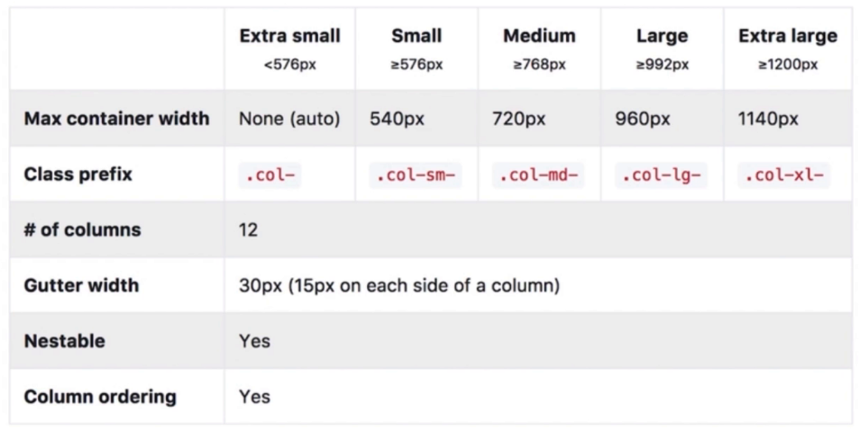

# Bootstrap

- 一个CSS框架
- twitter出品
- 提供通用基础样式

---

- 兼容IE10+
- 使用flexbox布局
- 抛弃Normalize.css
- 提供布局和reboot版本

---

- 基础样式
- 常用组件
- JS插件

## 基本用法

## JS组件

- 用于组件交互
  - dropdown
  - modal
  - ...
- 依赖
  - JQuery
  - Popper.js
  - bootstrap.js
- 使用方式
  - 基于data-*属性
  - 基于JS API

## 响应式布局

- 

## 定制方法

- 使用CSS同名类覆盖
- 修改源码重新构建
- 引用scss源文件 修改变量

    ```scss
    $primary: green;
    @import './bootstrap-custom/scss/bootstrap';
    ```

## 面试真题

1. Bootstrap的优缺点
   - 优点：CSS代码结构合理 现成的样式可以直接用
   - 缺点：定制较为繁琐 体积大
2. Bootstrap如何实现响应式布局
   - 原理：通过media query设置不同分辨率的class
   - 使用：为不同分辨率选择不同的网格class
3. 如何基于Bootstrap定制自己的样式
   - 使用CSS同名类覆盖
   - 修改源码重新构建
   - 引用scss源文件 修改变量
