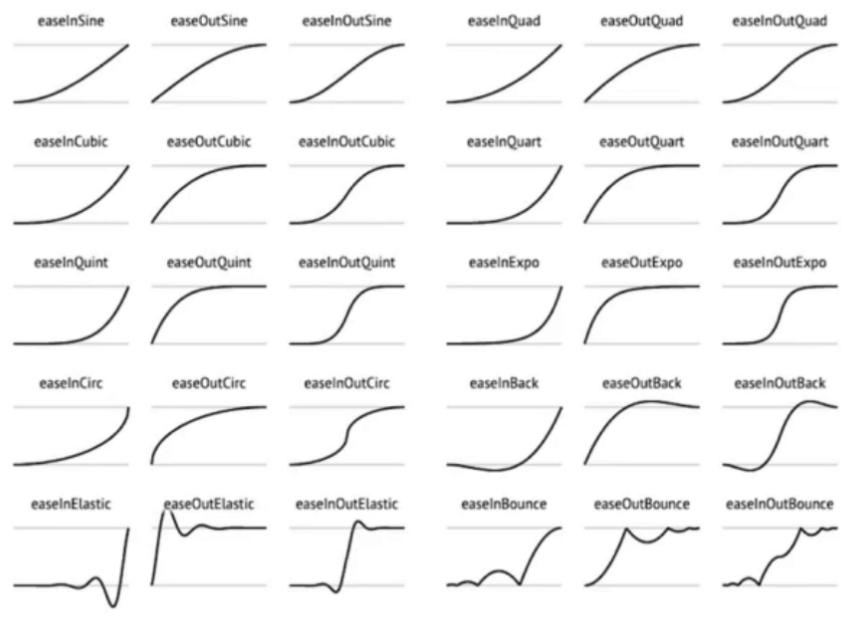

# CSS动画

- 原理
  - 视觉暂留作用
  - 画面逐渐变化
- 作用
  - 愉悦感
  - 引起注意
  - 反馈
  - 掩饰
- 类型
  - transition补间动画
  - keyframe关键帧动画
  - 逐帧动画

## 补间动画

- 位置
  - 平移 left / right / margin / transform
- 方位
  - 旋转 transform
- 大小
  - 缩放 transform
- 透明度 opacity
- 其它
  - 线性变换 transform
- timing(easing)
  - 定义动画进度和时间的关系
  - 
- 可以使用Chrome的动画面板

```css
.container {
    transition: /* 延时 1s */ width 1s, background 3s /* 或者直接 all 1s */;
    /* transition-delay: 1s; */

    /* timing（easing） 定义动画进度和时间的关系 */
    transition-timing-function: ease-in-out;
    /* 可以使用贝塞尔曲线自定义 */
}
```

## 关键帧动画

- 相当于多个补间动画
- 与元素状态的变化无关
- 定义更加灵活

```css
.container {
    animation: run 1s linear;
    animation-direction: reverse;
    animation-iteration-count: infinite;
    animation-play-state: paused;
    animation-fill-mode: forwards; /* backwards */
}
@keyframes run {
    0% /* = from */ {
        width: 100px;
    }
    10% {
        width: 200px;
    }
    100$ /* = to */ {
        width: 800px;
    }
}
```

## 逐帧动画

- 适用于无法补间计算的动画
- 资源较大
- 使用steps()

```css
.container {
    animation-timing-function: steps(1); /* 关键帧之间有几个过渡画面 */
}
@keyframes run {
    0% {
        background-position:0 0;
    }
    12.5% {
        background-position:-100px 0;
    }
    /* ... */
}
```

## 面试真题

1. CSS动画的实现方式有几种
   1. transition
   2. keyframes(animation)
2. 过渡动画和关键帧动画的区别
   - 过渡动画需要有状态变化
   - 关键帧动画不需要状态变化
   - 关键帧动画能控制更精细
3. 如何实现逐帧动画
   - 使用关键帧动画
   - 去掉补间(steps)
4. CSS动画的性能
   - 性能不坏
   - 部分情况下优于JS
   - 但JS可以做到更好
   - 部分高危属性 box-shadow等
