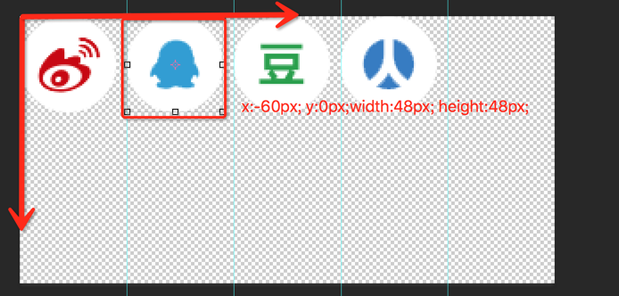

# CSS基础

- Cascading Style Sheet

## 选择器

- 用于匹配HTML元素
  - 有不同的匹配规则
  - 多个选择器可以叠加
- 分类和权重
  - 分类
    - 元素选择器 a{}
    - 伪元素选择器 ::before{}
    - 类选择器 .link{}
    - 属性选择器 [type=radio]{}
    - 伪类选择器 :hover{}
    - ID选择器 #id{}
    - 组合选择器 [type=checkbox]+label{}
    - 否定选择器 :not(.link){}
    - 通用选择器 *{}
  - 权重
    - ID选择器 +100
    - 类 属性 伪类 +10
    - 元素 伪元素 +1
    - 其它选择器 +0
    > 计算一个不进位的数字 : 权重大一级压死人
    - !important 优先级最高
    - 元素属性 优先级高
    - 相同权重 后写的生效
- 解析方式和性能
  - 浏览器解析方式从右往左

    ```css
    .body div .hello {
        color: red;
    }
    ```

    > .hello -> div -> .body

## 非布局样式

### 字体

- 字体族
  - serif : 衬线（有一些弯弯绕绕，比如宋体）
  - sans-serif : 无衬线
  - monospace : 等宽字体
  - cursive : 手写体
  - fantasy : 花体
- 多字体fallback
- 网络字体，自定义字体
- iconfont
  
```css
/* fallback */
body {
    /* font-family: "monaco"; */
    /* font-family: "monaco", "PingFang"; */
    font-family: "aaaaa", "monaco", "PingFang SC";
}
/* 字体族不加引号 */
.chinese {
    font-family: "PingFang SC", "Microsoft Yahei", monospace;
    /* font-family: "Microsoft Yahei", serif; */
}

/* 自定义字体，远程字体注意跨域问题 */
@font-face {
    font-family: "IF";
    src: url("./IndieFlower.ttf");
}
.custom-font {
    font-family: IF;
}
```

### 行高

- 行高的构成
  - inline-box
  - 行高不同渲染高度相同？
    - 文字的排版由**底线**，**顶线**和**基线**(for every character)
    - 行高决定上下多余的宽度，把inline-box撑起来，inline-box组成line-box
- 行高相关的现象和方案
  - 行高比字体高，字垂直居中
  - 字体大小不一样，以base line对齐
- 行高的调整

    ```css
    span {
        vertical-align: top; /* top line */
        vertical-align: bottom; /* bottom line */
        vertical-align: middle /* base line */;
        vertical-align: 5px; /* offset on base line */
    }
    ```

### 背景

- 背景颜色
- 渐变色背景
- 多背景叠加

  ```css
  .c1 {
      background: #FF0000;
      background: hsl(60, 100%, 100%); /* Hue, Saturation, Lightness */
      background: hsla(60, 100%, 100%, .3);
      background: rgb(255, 0, 0);
      background: rgba(255, 0, 0, .3);
      background: url(./test.png);
  }
  /* 使用多背景叠加可以实现更多的效果 */
  .c2 {
      background: -webkit-linear-gradient(left, red, green);
      background: linear-gradient(to right, red, green);
      background: linear-gradient(180deg, red, green);
      background: linear-gradient(135deg, red 0, green 10%, yellow 50%, blue 100%);
  }
  ```

- 背景图片和属性（雪碧图）
  

  ```css
  .c1 {
      height: 900px;
      background: red url(./test.png);
      background-repeat: no-repeat;
      background-position: center top;
      background-position: 20px 30px;
      background-size: 100px 50px;
  }

  /* 雪碧图 把很多图标合并到一张图中 在分别显示（裁切） */
  .c2 {
      width: 40px;
      height: 40px;
      background: url(./test_bg.png) no-repeat;
      background-position: -338px -46px;
      background-size: 261px 113px;
  }
  ```

- base64和性能优化
  - 小图标，少量图，减少HTTP连接数
  - 生产环境可以在打包的时候转base64
- 多分辨率适配
  - 移动端分辨率高，一个像素对应设备三个四个像素
  - 可以将原图片缩小相应倍数再去放置

### 边框

- 边框的属性
  - 线型
  - 大小
  - 颜色
- 边框背景图
- 边框衔接（三角形）

### 滚动

- 滚动行为和滚动条
  

### 文字折行

- overflow-wrap(word-wrap) 通用换行控制
  - 是否保留单词
- word-break 针对多字节文字
  - 中文句子也是单词
- white-space 空白处是否断行

### 装饰性属性及其它

- font-weight
- font-style:itatic
- text-decoration
- cursor

### CSS Hack

- Hack即不合法但生效的写法
- 主要用于区分不同浏览器
- 替代方案
  - 特性检测
  - 针对性加class

### 案例

- 美化checkbox
- 选项卡
- 树

### 面试真题

1. CSS样式（选择器）的优先级
   - 计算权重确定
   - !important
   - 内联样式
   - 后写的优先级高
2. 雪碧图的作用
   - 减少HTTP请求树 提高加载性能
   - 有一些情况下可以减少图片大小
3. 自定义字体的使用场景
   - 宣传/品牌/banner等固定文案
   - 字体图标
4. base64的使用
   - 用于减少HTTP请求
   - 适用于小图片
   - 体积约为原图的4/3
5. 伪类和伪元素的区别？
   - 伪类表状态
   - 伪元素是真的有元素
   - 前者单冒号，后者双冒号
6. 如何美化checkbox
   - label[for]和id
   - 隐藏原生input
   - :checked+label
