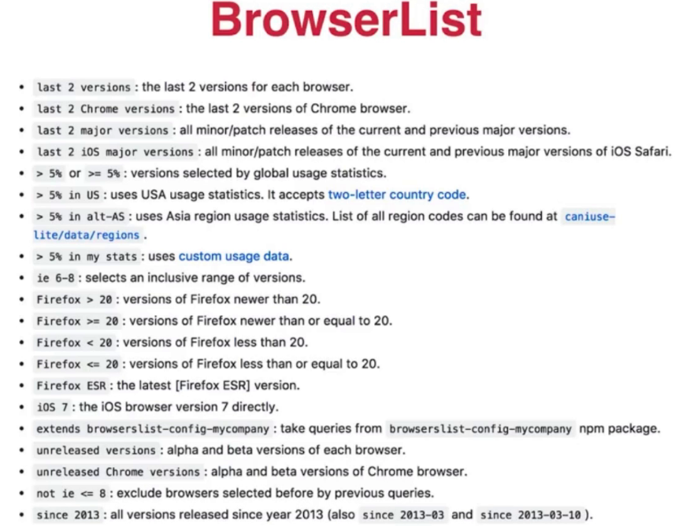
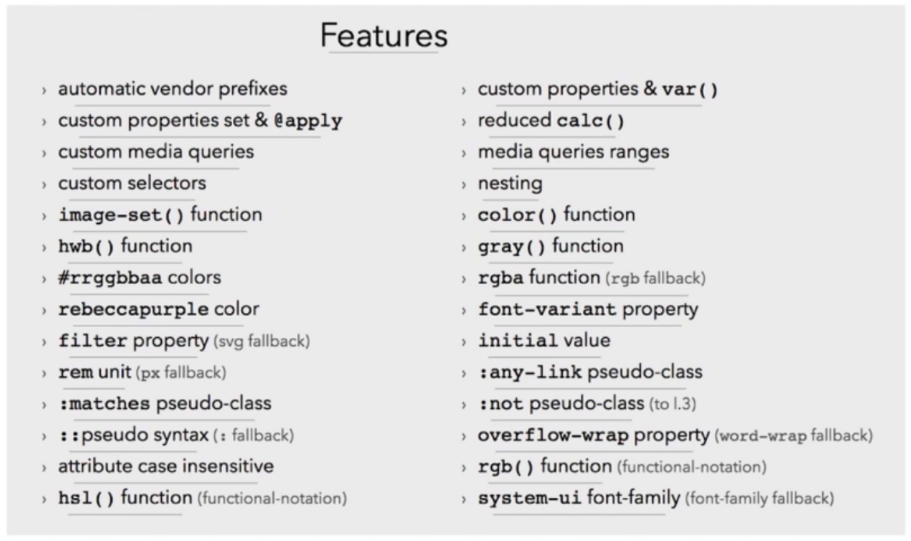

# CSS工程化

- 组织
- 优化
- 构建
- 维护

## PostCSS

- CSS -> PostCSS解析转换（模块化、加前缀、兼容性 etc.） -> CSS
- PostCSS本身只有解析能力
- 各种神奇的特性全靠插件
- 目前至少有200多个插件

---

- import 模块合并 postcss-import
- autoprefixer 自动加前缀，以适配不同浏览器
  - 
- cssnano 压缩代码
- cssnext 使用CSS新特性
- precss 变量、mixin、循环等

---

- postcss.config.js 配置使用什么插件

### cssnext

- 

### precss

- 类似预处理器
- 变量 / 条件 / 循环 / Mixin / Extend / import / 属性值引用

### PostCSS支持的构建工具

- CLI命令行工具
- webpack postcss-loader
  - JS是整个应用的核心入口
  - 一切资源均由JS管理依赖
  - 一切资源均由webpack打包
- Gulp gulp-postcss
- Grunt grunt-postcss
- Rollup rollup-postcss

### webpack和CSS

- css-loader 将CSS变成JS
- style-loader 将JS样式插入head
- ExtractTextPlugin 将CSS从JS中提取出来
- css modules 解决CSS命名冲突的问题
- less-loader sass-loader 各类预处理器
- postcss-loader PostCSS处理

## 面试真题

1. 如何解决CSS模块化问题
   - Less Sass等CSS预处理器
   - PostCSS插件（postcss-import / precss等）
   - webpack处理CSS（css-loader + style-loader）
2. PostCSS可以做什么
   - 取决于插件可以做什么
   - autoprefixer cssnext precss等 兼容性处理
   - import 模块合并
   - css语法检查 兼容性检查
   - 压缩文件
3. CSS modules是做什么的，如何使用
   - 解决类名冲突的问题
   - 使用PostCSS或者webpack等构建工具进行编译
   - 在HTML模板中使用编译过程产生的类名
4. 为什么使用JS来引用、加载CSS
   - JS作为入口，管理资源有天然优势
   - 将组件的结构、样式、行为封装到一起，增强内聚
   - 可以做更多处理（webpack）
