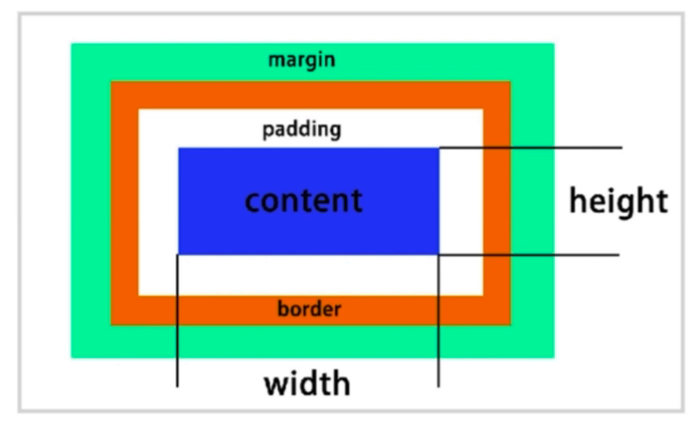

# CSS布局

- 早期以table为主（简单）
- 后来以技巧性布局为主（难）
- 现在有flexbox/grid
- 响应式布局

## 常见布局方法

### table表格布局

### 盒子模型

- 

### display / position

- 确认元素的显示类型
  - block
  - inline
  - inline-block
    - 相较于inline，可以设置宽高
    - vertical-align调整对齐方式
- 确认元素的位置
  - static
    - 直接按照文档流
  - relative
    - 可以加偏移，相对于元素本身，但不会改变本身占的空间
  - absolute
    - 相对于最近的relative或absolute
    - 层叠关系默认按照顺序，可用z-index自定义（relative, absolute, fixed）
  - fixed
    - 相对于可视区域

### flexbox

- 弹性盒子
- 盒子本来就是并列的
- 指定宽度即可

### float

- 元素“浮动”
- 脱离文档流
- 但不脱离文本流
- 原意是进行图片文字混排，紧密环绕
- 对自身的影响
  - 形成“块”（BFC）
  - 位置尽量靠上
  - 位置尽量靠左（右）
- 对兄弟的影响
  - 上面贴非float元素
  - 旁边贴float元素
  - 不影响其它块级元素位置
  - 影响其它块级元素内部文本
- 对父级元素的影响
  - 从布局上“消失”
  - 高度塌陷
    - 父元素 overflow:auto / hidden
    - 清除浮动

    ```css
    .containter::after {
        content: ' ';
        clear: both;
        display: block;
        visibility: hidden;
        height: 0;
    }
    ```

  - 经典三栏布局

### inline-block

- 像文本一样排block元素
- 没有清除浮动等问题
- 需要处理间隙
  - 父元素 font-size:0 子元素重新设置字体大小
- 自适应不大方便

### 响应式设计和布局

- 在不同设备上正常使用
- 一般主要处理屏幕大小问题
- 主要方法：
  - 隐藏+折行+自适应空间
  - rem / viewport / media query
  
  ```css
  <meta name="viewport" content="width=device-width, initial-scale=1.0">
  ```

  ```css
  /* media query + 隐藏 */
  @media (max-width: 640px) {
      .left {
          display:none;
      }
  }
  ```

  ```css
  /* media query + 折行 */
  @media (max-width: 640px) {
      .intro {
          margin:7px auto;
          display: block;
      }
  }
  ```

  ```css
  /* 自适应空间 */
  <meta name="viewport" content="width=320">
  
  /* 或者使用脚本动态适配 */

  /* 使用rem */
  html {
      font-size: 20px; /* 定义rem */
  }
  /* 根据不同设备适配 大的设备放上面 */
  @media (max-width: 375px) {
      html {
          font-size:24px;
      }
  }
  @media (max-width: 320px) {
      html {
          font-size:20px;
      }
  }
  ```

### 主流网站

- 国内大部分大型网站都是float布局
- 苹果 : flexbox

### 面试真题

1. 实现两栏（三栏）布局的方法
   - 表格布局
   - float+margin布局
   - inline-block布局
   - flexbox布局
2. position:absolute / fixed有什么区别？
   - 前者相对最近的 absolute / relative
   - 后者相对屏幕 (viewport)
3. display:inline-block的间隙
   - 原因：字符间距
   - 解决：消灭字符或者消灭间距
4. 如何清除浮动
   - 让盒子负责自己的布局
     - overflow:hidden(auto)
     - ::after{clear:both}
5. 如何适配移动端页面？
   - viewport
   - rem / viewport / media query
   - 设计上：隐藏 折行 自适应
